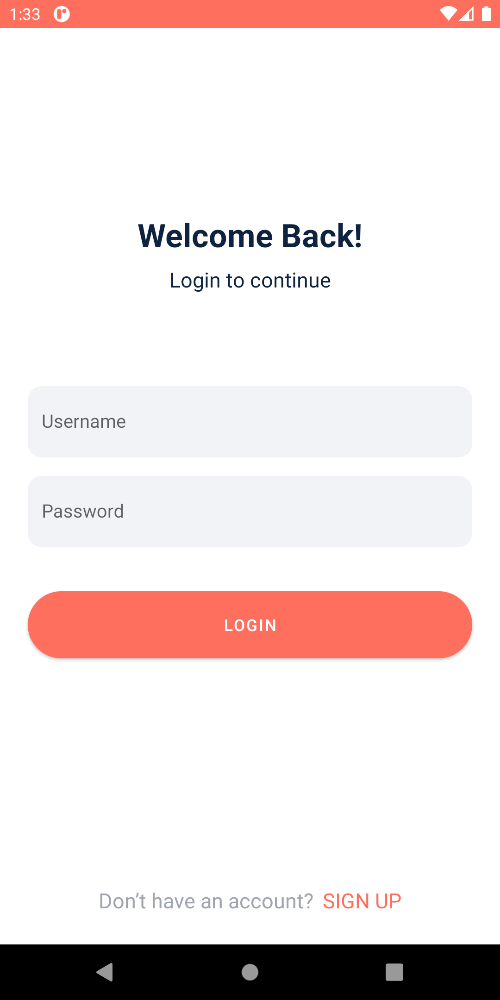
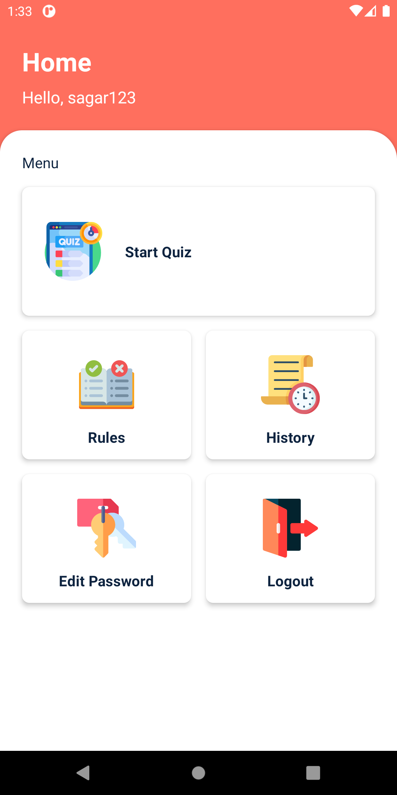

# 🧠 Quiz App 📝

    

    

# Github link 

	https://github.com/lakmina456/Quiz_App

## **🛠️ Technologies Used**

This project was built using the following technologies.

- Java
- Android Studio

## **Features**

- **📝 Multiple Choice Questions**: Present users with a variety of multiple-choice questions to test their knowledge.
  
- **🔍 Score Tracking**: Keep track of the user's score as they progress through the quiz.

- **📱 Responsive Design**: Ensure the app works well on various screen sizes and orientations.

- **📚 History**: Allow users to view their quiz history and performance over time.

- **🔑 Change Password**: Provide users with the ability to change their account password for security purposes.

## **🚀 Installation**
- Clone the repository: `git clone https://github.com/lakmina456/Quiz_App.git`

## 🤝 Contributing

Contributions are welcomed with open arms! 🙌 If you'd like to contribute to this project, 
please follow these steps:

1. Fork the repository.
2. Create a new branch (`git checkout -b feature/new-feature`).
3. Make your changes.
4. Commit your changes (`git commit -am 'Add new feature'`).
5. Push to the branch (`git push origin feature/new-feature`).
6. Create a new Pull Request.

## **Show your support**

Hit the Star button if you like this app!

## **📝 License**
This project is licensed under the MIT License.

## **📧 Contact**
If you have any questions or suggestions, feel free to reach out to me at [your-email@example.com].
